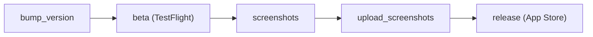

# Echo

Available on the [iOS App Store](https://apps.apple.com/us/app/echo-speech-therapy/id558585608) and the [macOS App Store](https://apps.apple.com/us/app/echo-speech-therapy/id558585608).

Hear yourself  and native speakers  to improve pronunciation.

Language practice / speech pathology / accent reduction

## Purpose

This app can help you improve pronunciation. Whether that is for speech pathology, accent reduction or studying a new language. It is extremely effective. This app does not intend to teach you all the vocabulary you need, it is not a language app, it is a pronunciation app.

See also my other app for speech pathology: [formant-analyzer](https://github.com/fulldecent/formant-analyzer)

## Intro

This iOS app provides the same functionality as the website [learnwithecho.com](https://learnwithecho.com).

It is my first serious iOS app and has gone through siginificant development over the years. It has been successful and brought in good money since 2008 or so, and I hope you can study it for your own benefit or to contribute improvements.

## License

You are welcome to read and study everything here. All contents (c) William Entriken, all contributions require assigment for this copyright. Will consider a more permissive license later.

## Release a new version

This project uses fastlane and App Store Connect API key authentication for release automation.

### One-time setup

1. Install Ruby via rbenv (macOS system Ruby is too old for fastlane):

   ```sh
   brew install rbenv ruby-build
   rbenv init # follow the printed shell setup instructions, then restart your shell
   rbenv install   # installs the version from .ruby-version
   bundle install
   ```

2. Create `fastlane/api_key.json`:

   ```json
   {
     "key_id": "ABCD123456",
     "issuer_id": "00000000-0000-0000-0000-000000000000",
     "key_filepath": "/absolute/path/to/AuthKey_ABCD123456.p8"
   }
   ```

### Recommended release flow

The pipeline has five stages.



Execute the end-to-end flow with the combined command:

```sh
bundle exec fastlane full_release # may add options from any part below; or it picks defaults
```

Or run each stage separately:

```sh
bundle exec fastlane bump_version           # may add bump:minor or bump:major
bundle exec fastlane build                  # every platform, or add platform name before verb
bundle exec fastlane beta                   # every platform, or add platform name before verb
bundle exec fastlane screenshots            # every platform, or ...; may add locales:... devices:...
bundle exec fastlane upload_screenshots     # every platform, or ...; may add locales:... devices:...
bundle exec fastlane release                # every platform, or ...; may add notes:"This release..."
```

Screenshot filter examples:

```sh
bundle exec fastlane screenshots platforms:ios locales:en-US devices:"iPhone 16 Pro"
bundle exec fastlane upload_screenshots platforms:mac locales:en-US devices:"Mac"
```

:information_source: `release` is submit-only. Run `screenshots` and `upload_screenshots` first if screenshots need to change.

:information_source: If a beta upload fails because the build number is behind App Store Connect, set the project build number once to remote highest + 1, commit, rerun, then continue local increments.

Each command part (and the end-to-end command) will print this evidence as available:

- Local built path
- Local screenshots preview
- ios TestFlight: <https://appstoreconnect.apple.com/apps/558585608/testflight/ios>
- ios Inflight version: <https://appstoreconnect.apple.com/apps/558585608/distribution/ios/version/inflight>
- macos TestFlight: <https://appstoreconnect.apple.com/apps/558585608/testflight/macos>
- macos Inflight version: <https://appstoreconnect.apple.com/apps/558585608/distribution/macos/version/inflight>
